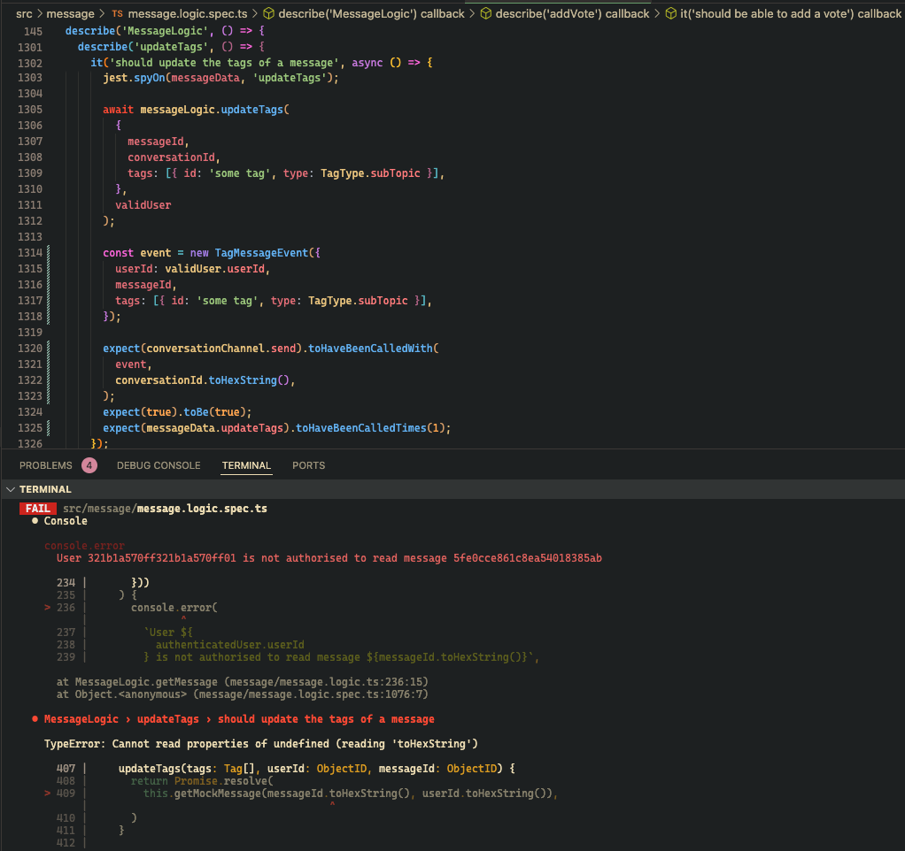
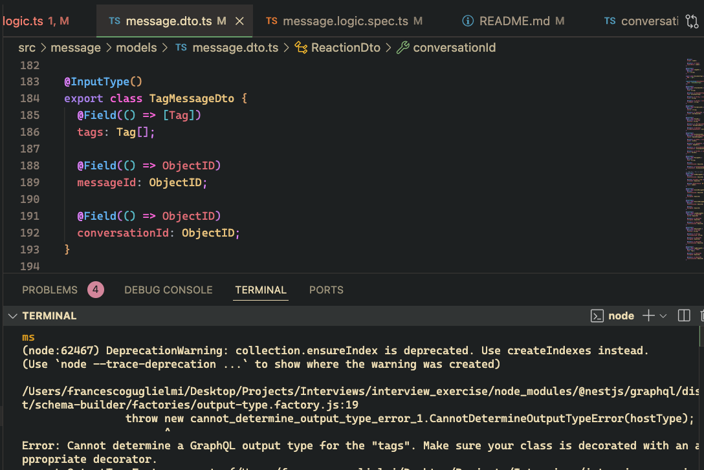

# Submission

As per my submission I could note that:
  - I was able to successfully fix what was required in part one and two.
  - I couldn't wrap my head around two errors that originate from the code in part three:
    1. The test failing has the same structure as tests that are passing:

    

    2. The application fails for not knowing what type are tags even if I declared it in message.dto.ts:

    

  - I hope these points can be object of a discussion during the interview

  Handles:

  https://github.com/davidbebb
  https://github.com/RichUnibuddy
  https://github.com/anlauren


## Chat Service

Chat service provides GraphQL and Rest interfaces to our chat API. We mostly use GraphQL for interacting with it. 

The service is built on [Nest](https://github.com/nestjs/nest), using TypeScript.
We use [Jest](https://jestjs.io/docs/getting-started) for testing and encourage Test Driven Development. 


## Prep
You'll want the following tools installed to help in the exercise:

| Dependency  | Install link |
|------|-----|
|Docker | https://docs.docker.com/get-docker/ |
|Nodejs | https://nodejs.org/en/download/package-manager|
|Nvm | https://github.com/nvm-sh/nvm/blob/master/README.md |

### Usage

cd to the repo (you'll fork and clone this in the exercise itself.)

First, get the supporting services running:

```bash
$ docker compose up -d
```

next, switch to the right versions of node, etc

```bash
$ nvm use
```

Finally, install the require dependencies

```bash
$ npm install
```

Once this is complete, you should be good the run the code - check package.json for examples of what functions are alreasy defined. 

e.g.

```bash
$ npm run test
```

# Interview Exercise

The exercise is broken into 3 parts. To attempt the exercise, we'd like you to fork this repo, making the changes to your own version of the code. 
We encourage you to submit solutions to each part of the exercise as seperate commits, back to your fork, so that it's easier to follow and discuss. 

When you've completed the exercise, please add the following github handles to your fork, so we can review your submission:

https://github.com/davidbebb
https://github.com/RichUnibuddy
https://github.com/anlauren

We encourage pair programming, but do want the exercise to be fair, so please make sure you can complete the exercise solo and explain your work. 

## Part 1

The service fails to start - ```npm run start:dev``` -  Use the messages to fix the code, so that the service runs successfully

## Part 2

A test is failing - ```npm run test``` - implement the code necessary to pass the test

## Part 3 - Strech

Currently, we allow tags to be added to a conversation, so we can help users to find things they're interested in.

We would like to extend the functionality, to allow the sender of a message to add or update tags on a single message, and allow other users to find messages based on these tags.

While we don't expect everyone to complete this part of the exercise, it will form the basis of disucssion in an interview. Please make as much progress with this, as you feel comfortable doing. Don't allow it to be all-consuming. A couple of hours at most for all parts of the exercise. 

We'd love to hear about
* How you would go about implementing the solution
* What problems you might encounter
* How you would go about testing
* What you might do differently

# Additional
The following docs are from the live service repo. You may find them helpful. 


# development
$ npm run start:dev
```

You are now able to make requests to the api.
There are two interfaces; a [rest interface](http://localhost:3000/api), and a [graphql interface](http://localhost:3000/graphql).


The rest interface allows a client to set up a new conversation, and to manage who has access to it.

The graphql interface allows users to send and recieve messages in the conversations that they are in.


You can create a conversation through the [Swagger UI](http://localhost:3000/api) to attain a conversationId (to use with the graphql end points). Some of the requests require authorization. Select the `Authorize` button (top right of the screen) and enter the key `ssssh`. To create a conversation select `Try it out` in POST /conversation.

## Structure

The code in each module is separated into 3 layers
1) controllers and/or resolvers: These provide the external interfaces for the REST and Graphql interfaces respectively, and passes the request to the logic layer
2) logic: This implements common business rules, and can make requests to other modules and the repository layer to fulfil the request.
3) repository: This manages hwo data is stored in the module. It should only be used directly by the logic layer.


my-app/
├─ src/                             
│  ├─ example-graphql/              # Example module
│    ├─ example-graphql.module.ts
│    ├─ example-graphql.repository.spec.ts
│    ├─ example-graphql.repository.ts --------- Controls how the data is stored
│    ├─ example-graphql.resolver.spec.ts
│    ├─ example-graphql.resolver.ts ----------- Provides the external interface for the service
│    ├─ example-graphql.logic.spec.ts
│    ├─ example-graphql.logic.ts -------------- Implements common business logic
│  ├─ app.module.ts
│  ├─ main.ts

## Testing

- Unit test file of each file is created in the same path under name of <fileName>.spec.ts
- E2e tests are in test folder
- Jest is used for creating these tests.

To run the unit tests you wil need to have the databases running - run `docker compose up -d`

```bash
# unit tests
$ npm run test
$ npm run test:watch

# e2e tests - the service needs to be running - see Running the app
$ npm run test:e2e
$ npm run test:e2e:watch

```


## Mocking the unibuddy_api end point (e.g /api/v1/users/)

You may want to mock data from the ub_internal_api end points. We can do this using [Mock Server](https://www.mock-server.com/)


For `/api/v1/users/{$userId}` an example would be 

url: /api/v1/users/599ebd736a1d100004aeb744

```
{
"account_role": "university",
"email": "edinburgh+admin@unibuddy.co",
"first_name": "Uni",
"id": "599ebd736a1d100004aeb744",
"last_name": "Admin",
"profile_photo": null
}
```
